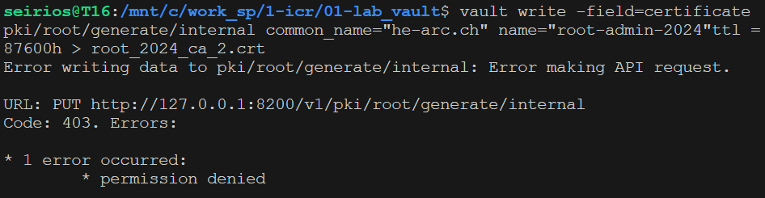

# ICR 24
## Lab #1
Titus Abele

## Unseal
### Goal
The goal of the unseal process is to present keys to the user. These keys (or tokens) are used to unlock the server. During its lifetime, the server will always be in a sealed state and to unseal it, the user must present a certain number of keys (the key threshhold). The keys must therefore be kept safe by the user because of the uniqueness of the Initialization process presenting the keys. Once shown, the keys will never be shown again. The documentation even says:

```
Initialization outputs two incredibly important pieces of information: the unseal keys and the initial root token. This is the only time ever that all of this data is known by Vault, and also the only time that the unseal keys should ever be so close together.
```

The section clearly hints towards the fact that these keys (and the accompanying root token) are used as a security mechanism with redundancy. As a matter of fact, multiple keys are better than one because we can split responsibilities (not give a single user the one and only key but give multiple users some keys). This is further emphasized by the fact that we can regenerate the master key (that isn't even revealed) by using some of the given keys (not all of them are required for the process). Furthermore, the documentation indicates that using some of the keys, more keys can be generated, this means that even if some of the keys get lost, new ones may be generated.

To unseal the server, the user has to present a certain number of keys (key threshold) and once the required number of keys is presented, the server can verify and unseal the vault. It is important to note that during the times between unsealing (when the vault is sealed), the server cannot look into the vault because it does not know how to decrypt it which greatly increases trust.

## Safety officer
A safety officer is someone responsible for safeguarding a key. This key, in conjonction with another key (from another safety officer) is used to unseal the vault. This means that no single safety officer has unseal rights and everytime the vault needs to be unsealed, two safety officers need to be present. This is another layer of safety added to the unseal process. The root of trust is shifted to physical users (the safety officers), they still need to be chosen with care.

Should a safety officer leave the company, the other safety officers must [rekey](https://developer.hashicorp.com/vault/docs/commands/operator/rekey). This process involves the regeneration of new keys. As a matter of fact, should no new officer be hired, the number of keys required would drop to 5. 

## Starting the vault
First setup:
```
mkdir -p ./vault/data
vault server -config="config.hcl"
export VAULT_ADDR='http://127.0.0.1:8200'
```
Then we can run the initialisation phase:

```
seirios@T16:/mnt/c/work_sp/1-icr/01-lab_vault$ vault operator init -key-shares=6 -key-threshold=2
Unseal Key 1: n+JPG1gPHjGtPde2uc9pDToINCKPfIV+EWFc2WIlLm6U
Unseal Key 2: 2pWDjCBtexpHvxYH+rsycm+V0cFU+KhX4hitWFdkESkd
Unseal Key 3: MFQp3WQ+oanYfDpjFfXJv53Ly95vPh7n5dCpFPWIvMBd
Unseal Key 4: DGVdbqVEqy/6hJ6GSfQODrrYGWxwpvhBTAEg3Ij0YdwV
Unseal Key 5: dSPlShxcxIIy/vvSVoGSwMhWLj20ujPOFqlYlcDJg4fU
Unseal Key 6: oL/LQ/lamWIAbSnHF1e1fln4ZeKFvUerjYNGTNINNtcv

Initial Root Token: hvs.oSAamVdvppbeocqMtHijdjrp
```
### Status
First we need to set the root token environment variable:
```
seirios@T16:/mnt/c/work_sp/1-icr/01-lab_vault$ export VAULT_TOKEN='hvs.oSAamVdvppbeocqMtHijdjrp'
```
Then we can check the status:
```
seirios@T16:/mnt/c/work_sp/1-icr/01-lab_vault$ vault status
Key                Value
---                -----
Seal Type          shamir
Initialized        true
Sealed             true
Total Shares       6
Threshold          2
Unseal Progress    0/2
Unseal Nonce       n/a
Version            1.15.5
Build Date         n/a
Storage Type       raft
HA Enabled         true
```

### Unseal
```
seirios@T16:/mnt/c/work_sp/1-icr/01-lab_vault$ vault operator unseal
Unseal Key (will be hidden): 
Key                Value
---                -----
Seal Type          shamir
Initialized        true
Sealed             true
Total Shares       6
Threshold          2
Unseal Progress    1/2
Unseal Nonce       8e0db0de-cb37-cdf5-4d8c-aab2ffd691d5
Version            1.15.5
Build Date         n/a
Storage Type       raft
HA Enabled         true
seirios@T16:/mnt/c/work_sp/1-icr/01-lab_vault$ vault operator unseal
Unseal Key (will be hidden): 
Key                     Value
---                     -----
Seal Type               shamir
Initialized             true
Sealed                  false
Total Shares            6
Threshold               2
Version                 1.15.5
Build Date              n/a
Storage Type            raft
Cluster Name            vault-cluster-7c5ab769
Cluster ID              4b84632e-c90e-5692-7b46-0cf47be0ae11
HA Enabled              true
HA Cluster              n/a
HA Mode                 standby
Active Node Address     <none>
Raft Committed Index    29
Raft Applied Index      29
```

## Admin Policy
After unsealing:
```
seirios@T16:/mnt/c/work_sp/1-icr/01-lab_vault$ vault policy write admin admin-policy.hcl
Success! Uploaded policy: admin
```
And **reseal**!
```
seirios@T16:/mnt/c/work_sp/1-icr/01-lab_vault$ vault operator seal
Success! Vault is sealed.
```

## PKI
### Updating admin policy
For PKI we require following paths to be added to our policy:
```
path "sys/mounts/*"
path "sys/mounts"
path "pki*"
```

The tutorial's admin policy already includes the mounts paths so we only add this at the end:

```
# Work with pki secrets engine
path "pki*" {
  capabilities = [ "create", "read", "update", "delete", "list", "sudo" ]
}
```
Don't forget to update the admin policy server-side:
```
seirios@T16:/mnt/c/work_sp/1-icr/01-lab_vault$ vault policy write admin admin-policy.hcl
Success! Uploaded policy: admin
```

### Create an admin token
Following the CLI [documentation](https://developer.hashicorp.com/vault/docs/commands/token/create), we can create a token like this:
```
seirios@T16:/mnt/c/work_sp/1-icr/01-lab_vault$ vault token create -policy=admin
Key                  Value
---                  -----
token                hvs.CAESIMmCG2_dXIseaaSWa1Q0sEJXXFlLWht-rBZbRM0j0V00Gh4KHGh2cy5RdGlCVjlyUUhMYTd0OU5sUWpSa2JUWG8
token_accessor       6vmUEVC6ecsDWK4sJIXo78Fj
token_duration       768h
token_renewable      true
token_policies       ["admin" "default"]
identity_policies    []
policies             ["admin" "default"]
```
Set the token:
```
seirios@T16:/mnt/c/work_sp/1-icr/01-lab_vault$ export VAULT_TOKEN='hvs.CAESIMmCG2_dXIseaaSWa1Q0sEJXXFlLWht-rBZbRM0j0V00Gh4KHGh2cy5RdGlCVjlyUUhMYTd0OU5sUWpSa2JUWG8'
```

### Enabling PKI
After unsealing:
```
seirios@T16:/mnt/c/work_sp/1-icr/01-lab_vault$ vault secrets enable pki
Success! Enabled the pki secrets engine at: pki/

seirios@T16:/mnt/c/work_sp/1-icr/01-lab_vault$ vault secrets tune -max-lease-ttl=87600h pki
Success! Tuned the secrets engine at: pki/
```

### Creating HEIG-VD Root
To generate the root certificate for `heig-vd.ch`:
```
seirios@T16:/mnt/c/work_sp/1-icr/01-lab_vault$ vault write -field=certificate \
    pki/root/generate/internal \
    common_name="heig-vd.ch" \
    issuer_name="root-admin-2024" \ 
    ttl=87600h > root_2024_ca.crt
```
This created a file called `root_2024_ca.crt` in the root folder. This is the root certificate of HEIG-VD.
Here the list of current issuers:
```
seirios@T16:/mnt/c/work_sp/1-icr/01-lab_vault$ vault list pki/issuers/
Keys
----
7205352f-465c-7df5-6556-2265d3274444

seirios@T16:/mnt/c/work_sp/1-icr/01-lab_vault$ vault write pki/config/urls \
    issuing_certificates="$VAULT_ADDR/v1/pki/ca" \
    crl_distribution_points="$VAULT_ADDR/v1/pki/crl"
Key                        Value
---                        -----
crl_distribution_points    [http://127.0.0.1:8200/v1/pki/crl]
enable_templating          false
issuing_certificates       [http://127.0.0.1:8200/v1/pki/ca]
ocsp_servers               []
```

### Creating HEIG-VD Intermediate
Enable the intermediate PKI:
```
seirios@T16:/mnt/c/work_sp/1-icr/01-lab_vault$ vault secrets enable -path=pki_int pki
Success! Enabled the pki secrets engine at: pki_int/
seirios@T16:/mnt/c/work_sp/1-icr/01-lab_vault$ vault secrets tune -max-lease-ttl=43800h pki_int
Success! Tuned the secrets engine at: pki_int/
```
And write the cert:
```
seirios@T16:/mnt/c/work_sp/1-icr/01-lab_vault$ vault write -format=json \
    pki_int/intermediate/generate/internal \
    common_name="heig-vd.ch Intermediate Authority" \
    issuer_name="heig-dash-vd-dot-ch-intermediate" | \
    jq -r '.data.csr' > pki_intermediate.csr
```
A file `pki_intermediate.csr` is created.
And finally, we sign it:
```
seirios@T16:/mnt/c/work_sp/1-icr/01-lab_vault$ vault write -format=json \ 
    pki/root/sign-intermediate \
    issuer_ref="root-admin-2024" \
    csr=@pki_intermediate.csr format=pem_bundle ttl="43800h" | \
    jq -r '.data.certificate' > intermediate.cert.pem
```
The file `intermediate.cert.pem` has been created.

### Creating specific roles
First we set the certificate to the `pki_int` engine:
```
seirios@T16:/mnt/c/work_sp/1-icr/01-lab_vault$ vault write \
    pki_int/intermediate/set-signed \
    certificate=@intermediate.cert.pem
```
Then we create a role for `intra.heig-vd.ch`:
```
seirios@T16:/mnt/c/work_sp/1-icr/01-lab_vault$ vault write \
    pki_int/roles/intra-heig-vd-ch \ 
    issuer_ref="$(vault read -field=default pki_int/config/issuers)" \
    allowed_domains="heig-vd.ch" \
    allow_subdomains=true \
    max_ttl="720h"
```
### Creating intra policy
We create the `intra-policy.hcl` file, fill it and load it with:
```
seirios@T16:/mnt/c/work_sp/1-icr/01-lab_vault$ vault policy write intra intra-policy.hcl
Success! Uploaded policy: intra
```
### Generating a certificate
Using this command we generate a certificate for `intra.heig-vd.ch`:

```
seirios@T16:/mnt/c/work_sp/1-icr/01-lab_vault$ vault write \
  pki_int/issue/intra-heig-vd-ch \
  common_name="intra.heig-vd.ch" \
  ttl="24h" 
```

### Generating a wildcard certificate
Using this command we generate a certificate for `*.heig-vd.ch`:

```
seirios@T16:/mnt/c/work_sp/1-icr/01-lab_vault$ vault write \
  pki_int/issue/intra-heig-vd-ch \ 
  common_name="*.heig-vd.ch" \
  ttl="24h"
```


# Questions
1) Why is it recommended to store the root certificate private key outside of Vault (we did not do
this here)?

Should an attacker gain access to the Vault, he could manage to abuse the CA (to which the on-site stored private key belongs to) and issue verified certificates. It is the foundation of trust for the entire PKI. Storing it off-site also respects the separation of duties principle.

2) Where would you typically store the root certificate private key?


Optimally, the key would be stored in a Hardware Security Module (HSM). This would provide the best protection against a variety of different threats such as physical tampering, software attacks or even unauthorized access. Alternatively, the key could be stored in a dedicated, secure machine. 

3) What do you need to do in Vault to store the root certificate private key outside of Vault?

Vault automatically generates the keys outside of the vault. You can, however, configure Vault to use an external key management solution (such as the aforementioned HSM). 

4) How is the intermediate certificate private key secured?

The intermediary key is stored inside the vault. The vault, by design, should be encrypted and safe so the intermediary key can't leak unless the root key leaks in which case the whole vault is compromised.

5) In the certificate for intra.heig-vd.ch, what is its duration of validity? What is the name of its issuer?

The `ttl` flag in the command specified 24h. The name of the issuer is `default`:

```
seirios@T16:/mnt/c/work_sp/1-icr/01-lab_vault$ vault read pki_int/config/issuers
Key                              Value
---                              -----
default                          f5f634b2-4fe9-7dcf-9a66-868d10fa16ff
default_follows_latest_issuer    false
```

6) What do you need to do concretely for the intra.heig-vd.ch  certificate to be accepted by browsers?

We would require a real CA to sign the certificate. Also, for some browsers, HTTPS is required.

7) What is a wildcard certificate? What are its advantages and disadvantages?

A wildcard certificate secures an entire domain as well as all subdomains with one certificate. It is cost-effective, easy to set up and manage (one single certificate for all subdomains so if you want to revoke all subdomains it requires less operations), scalable (adding a subdomain will not require a new certificate). However, it is a big security risk (someone could create a subdomain and misuse the certificate), limited validation (you cannot revoke a single subdomain), not ideal for all situations. In short, it is acceptable for controlled environments, use individual certificates for production.

# Users
To enable authentication and users:
```
seirios@T16:/mnt/c/work_sp/1-icr/01-lab_vault$  vault auth enable userpass
Success! Enabled userpass auth method at: userpass/
```
To create a user `toto`:
```
seirios@T16:/mnt/c/work_sp/1-icr/01-lab_vault$ vault write \
    auth/userpass/users/toto \
    password=titi \
    policies=intra
Success! Data written to: auth/userpass/users/toto
```
To create a user `admin`:
```
seirios@T16:/mnt/c/work_sp/1-icr/01-lab_vault$ vault write \
    auth/userpass/users/admin \
    password=admin \
    policies=admin
Success! Data written to: auth/userpass/users/admin
```
Let's login using `toto`'s credentials:
```
seirios@T16:/mnt/c/work_sp/1-icr/01-lab_vault$ vault login -method=userpass \
    username=toto \
    password=titi

WARNING! The VAULT_TOKEN environment variable is set! The value of this
variable will take precedence; if this is unwanted please unset VAULT_TOKEN or
update its value accordingly.

Success! You are now authenticated. The token information displayed below
is already stored in the token helper. You do NOT need to run "vault login"
again. Future Vault requests will automatically use this token.

Key                    Value
---                    -----
token                  hvs.CAESIMJBoMtGNZfYj6V4pDmr3QYiG6keeR7mp7lLHtcGq7DIGh4KHGh2cy5SVUhNNXdUQW4wMnhuVmFIeFlnbHQ4NmI
token_accessor         ZXHHeJVs7MS0MvJvighkjCzc
token_duration         768h
token_renewable        true
token_policies         ["default" "intra"]
identity_policies      []
policies               ["default" "intra"]
token_meta_username    toto
```
We set the correct token for `toto`:
```
seirios@T16:/mnt/c/work_sp/1-icr/01-lab_vault$ export VAULT_TOKEN='hvs.CAESIMJBoMtGNZfYj6V4pDmr3QYiG6keeR7mp7lLHtcGq7DIGh4KHGh2cy5SVUhNNXdUQW4wMnhuVmFIeFlnbHQ4NmI'
```
Once this is done we can try and create a new ressource:
```
seirios@T16:/mnt/c/work_sp/1-icr/01-lab_vault$ vault write -field=certificate pki/root/generate/internal common_name="he-arc.ch" name="root-admin-2024"ttl =87600h > root_2024_ca_2.crt
Error writing data to pki/root/generate/internal: Error making API request.

URL: PUT http://127.0.0.1:8200/v1/pki/root/generate/internal
Code: 403. Errors:

* 1 error occurred:
        * permission denied
```

A screenshot for proof:


# Questions
These questions were inspired from: https://developer.hashicorp.com/vault/docs/internals/security


1) How is the root key and the encryption key used to secure Vault?

The **root key** (secret shares) is only used for unsealing the Vault. It is generally split into multiple shares for enhanced security (e.g., 3 of 5 required). In this lab, we used 6, one for each Safety Officer. These keys are **never used for encryption**.

The **encryption key** protects the data stored inside the vault. This encryption key is itself encrypted by the root key (after the initial unsealing process) and used for data encryption as well as decryption. However, this key is **never exposed to the users**.

2) What is key rotation and when is it done?

Key rotation stands for regularly changing the encryption key used to protect data in Vault. This mecanism greatly limits the damage from compromised keys and improves security posture. There are three strategies to do key rotation:

* Scheduled: Keys are automatically rotated at predefined intervals (e.g., every 90 days).
* Event-driven: Keys are rotated in response to specific events, such as a security incident or system upgrade.
* Risk-based: Rotation is triggered based on the sensitivity of the data being stored, with more frequent rotation for highly sensitive data.

3) What can you say about the confidentiality of data in the storage backend? How is it done?

There are multiple layers to how vault treats its claims towards confidentiality:

* **Untrusted Storage**: Vault treats the storage backend as untrusted, meaning it assumes the backend may be vulnerable to unauthorized access.
* **Security Barrier**: All data leaving Vault for the backend goes through a security barrier.
* **Encryption**: The security barrier encrypts the data using a strong cipher (e.g., 256-bit AES) before storing it.
* **Key Management**: The encryption key used by the barrier is never stored in the backend, further enhancing security.

Overall it is a very efficient way of hindering unallowed access to the vault.

1) What can you say about the security of Vault against an adversary that analyses the memory of
the server that runs Vault?

To quote the documentation:

* Protecting against memory analysis of a running Vault. If an attacker is able to inspect the memory state of a running Vault instance, then the confidentiality of data may be compromised.

This happening is highly unlikely, but should it happen, it would not be great.