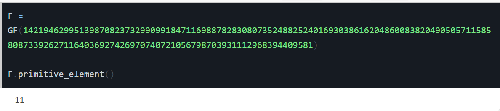

# Series 1
Titus Abele

## 1 Code review: Randomness Generation

1) Execute it few times. You should notice at least two weird behaviours.

It seems as though sometimes when executing the programm the generated string is just a repeated sequence. In this case, the program does not actually generate random numbers but rather random compositions of the same sequence.
```
$ python prng.py
9577d574abbeaba55df55d2aefaae9577d574abbeaba55df55d2aefaae9577d574abbeaba55df55d2aefaae9577d574abbeaba55df55d2aefaae9577d574abbeaba55df55d2aefaae9577d574abbeaba55df55d2aefaae9577d574abbeaba55df55d2aefaae9577d574abbeaba55df55d2aefaae9577d574abbeaba55cff68c4
```
The second phenomenon happens when the code generates many times the same sequence (like 4 -> 0100) except for the last few bits:
```
$ python prng.py
0000000000000000000000000000000000000000000000000000000000000000000000000000000000000000000000000000000000000000000000000000000000000000000000000000000000000000000000000000000000000000000000000000000000000000000000000000000000000000000000000000000000000072

$ python prng.py
4444444444444444444444444444444444444444444444444444444444444444444444444444444444444444444444444444444444444444444444444444444444444444444444444444444444444444444444444444444444444444444444444444444444444444444444444444444444444444444444444444444444444447
```

2) Blum-Micali is probably secure. What is the mistake in the code (warning: some maths
might be required here).

The cast to int was first believed to be the problem but it turns out that python merged int and long types into int. Which means that there is no overflow until it reaches the number 8 to the power of *sysmax*. See: https://stackoverflow.com/questions/2104884/how-does-python-manage-int-and-long. 

Also I noticed that `g`  was not a generator and the code therefore does not correspond to the standard. This was done with this snippet:
```python
# Verify that g is a generator
    for i in range(1, p):
        if pow(g,i,p) == 1:
            print("g is not a generator")
            break
    else:
        print("g is a generator")
```
Which in turn told me that `g` was in fact not a generator.

Using sage:

We find that `11` is a primitive of `p` so we can use that instead. The resulting randomness already looks much better.

```
HES-SO+titusvit.abele@T16 MINGW64 /c/work_sp/1-icr/02-series_randomness (main)
$ python prng.py
26f33722648976036a48b1d9c1dd177215338a1db7c4cc7918fda8d8d872ad6a20093c4598e080417aae5a8802bc00e19852ba3605086a767278d5265423c4bd3e8a3ff7c2007538682b9f2816df13804def900544eac1824214251fe5a6dcdfe4d4deb7a52e150c6802b0876aa80974b2a5ac1135467eedee99df3ee701c786

HES-SO+titusvit.abele@T16 MINGW64 /c/work_sp/1-icr/02-series_randomness (main)
$ python prng.py
77ad3d28a6448d5cc0040c81c4ee561d60e8f75f76b15633fd81329b1a8421cbaec419b654e003fab7aed29a3b264b2c862b225bb75db150d36f876bd9488658d1ea4bcfb4ef0dd048d6acb55ba48415d65acfe7dcb237ff3f4ffcbf415654f307b239aecf599c7a80d77b936f8722bc8fc4abaed95cf8b804dd96a34963fc50
``` 
